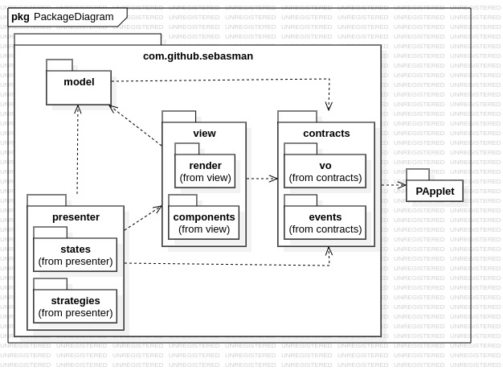
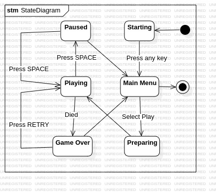

<p align="center">
  <a href="https://opensource.org/licenses/MIT"></a>
  
  
  
</p>

<p align="center">
  
</p>

> A modern take on the classic Snake game, engineered with a focus on clean, decoupled architecture, classic design patterns, and multiple AI-driven gameplay modes.

ViperVision is a comprehensive implementation of the Snake game built from the ground up using Java and the Processing library for rendering. More than just a game, it serves as a practical case study for applying robust software design principles to build a flexible, maintainable, and extensible application.

---

## ✨ Features

* **Classic Gameplay:** Smooth, interpolated movement, food consumption, and score tracking.
* **Multiple Game Modes:**
    * **Human Player:** Take control with the arrow keys in a responsive input-buffered system.
    * **Pathfinding AI (WIP):** Watch the snake autonomously navigate using algorithms like A* to find the optimal and safest path to the food.
    * **Genetic Algorithm AI (Planned):** Observe an AI that evolves and learns to play through generations of simulated evolution.
* **Polished UI/UX:** Interactive menus with custom fonts, graphics, and a fluid game loop.
* **Clean, Decoupled Architecture:** Built to be easily understood, modified, and extended.

---

## 🏗️ Architecture & Design

ViperVision is engineered with a modern, decoupled architecture focusing on the Single Responsibility Principle and Composition over Inheritance. This ensures the codebase is clean, scalable, and easy to maintain.  
* **Core Principles**
  * **Unidirectional Dependencies**: The architecture centers around a core package that defines the application's contracts (interfaces). All other packages (entities, states, strategies, ui) depend on core, but core does not depend on them. This prevents circular dependencies and creates a clean, plug-and-play structure.
  * **Dependency Injection**: Dependencies are provided to objects rather than created by them. For instance, the PlayingState is injected with a ControlStrategy, allowing it to function without knowing the concrete type of the strategy.
* **Design Patterns in Use**  
The project heavily relies on established design patterns to solve common problems elegantly:  
  * **State Pattern**: Manages the game's high-level flow (MenuState, PlayingState, PausedState, etc.). Each state encapsulates its own logic, and a Game class context seamlessly transitions between them using a state stack.
  * **Strategy Pattern**: Decouples the snake's control logic from the main game loop. This allows switching between different control mechanisms (HumanControlStrategy, FollowFoodStrategy) without altering any core game code.
  * **Command Pattern**: Decouples UI components (like Button) from the actions they perform. Buttons are given a Command object to execute on click, making them highly reusable and configurable.
  * **Singleton Pattern**: Used for global, unique objects like GameRenderer or stateless objects like HumanControlStrategy to ensure a single instance exists throughout the application, saving resources.
  * **Composite & Layout Manager**: The UI is built using a composite structure. UiComponent is the base interface for elements like buttons and labels. Layout classes (e.g., VerticalLayout) act as composite objects that manage and arrange collections of components. This creates a powerful, reusable, and declarative UI system.
  * **Provider Pattern (a form of DI)**: The UiProvider interface allows objects like a ControlStrategy to provide a list of UI components to the current State without the state needing to know the strategy's concrete type. This is key to building dynamic UIs.

### Key Diagrams

Here are some diagrams illustrating the project's structure and flow.

#### Package Structure



#### State Machine




#### Class Diagram

You can access all class diagrams in the file [`docs/diagrams/diagrams.mdj`](docs/diagrams/diagrams.mdj).

---

## 🛠️ Technologies Used

* **Language:** Java 24
* **Graphics & Interaction:** [Processing](https://processing.org/) (v4.4.1)
* **Build Tool:** [Apache Maven](https://maven.apache.org/)
* **Diagramming:** StarUML / Mermaid

---

## 🚀 Getting Started

Follow these instructions to get a copy of the project up and running on your local machine.

### Prerequisites

* **JDK 24** (or the version specified in `pom.xml`). Make sure `JAVA_HOME` is set correctly.
* **Apache Maven** installed and configured in your system's PATH.

### Installation & Running

1.  **Clone the repository:**
    ```bash
    git clone https://github.com/SebAs-man/ViperVision.git
    cd ViperVision
    ```
2.  **Build and run the project using Maven:**
    ```bash
    mvn clean package exec:java
    ```

---

## 🎨 A Note on Design

This project's primary focus is on software architecture and clean, maintainable code. While efforts were made to create a pleasant user interface, the visual design choices reflect an engineer's perspective. Contributions, ideas, and pull requests from design-savvy individuals are most welcome!

---

## 📜 License

This project is distributed under the MIT License. See the [`LICENSE`](LICENSE) file for more information.

## 🙏 Acknowledgements

* The [Processing Foundation](https://processingfoundation.org/) for their amazing creative coding environment.
* You, for exploring this project!