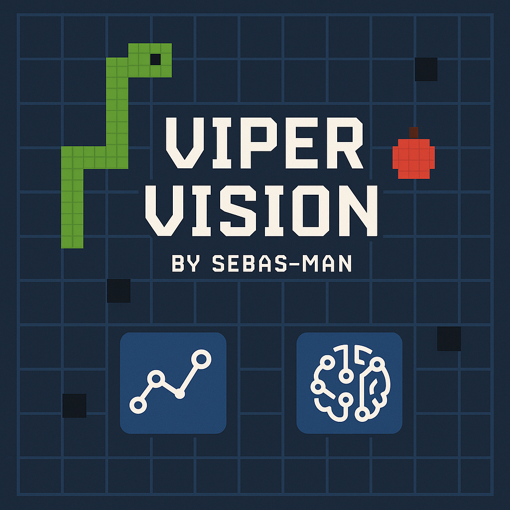
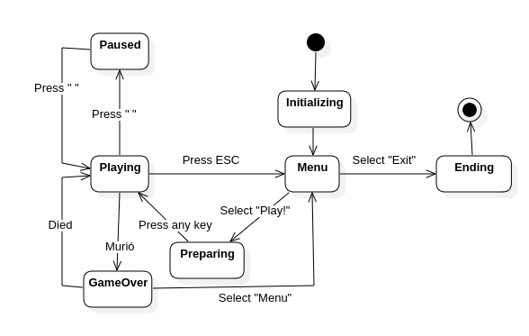

# ViperVision 🐍

<p align="center">
  <a href="https://opensource.org/licenses/MIT"></a>
  
  
  
  
  </p>

<p align="center">
  
</p>

<p align="center">
  <em>A classic Snake game with AI players, built using Java, Processing, and modern design config.</em>
  <br/> 
</p>

ViperVision is a classic Snake game implementation using Java and the Processing library. It features multiple game modes, including human control and AI players driven by pathfinding and genetic algorithms. Built with the MVP pattern and various design principles.

---

## Table of Contents

- [Features](#features)
- [Architecture & Design](#architecture--design)
- [Key Diagrams](#key-diagrams)
- [Technologies Used](#technologies-used)
- [Getting Started](#getting-started)
    - [Prerequisites](#prerequisites)
    - [Installation](#installation)
- [How to Run](#how-to-run)
- [Development](#development)
- [License](#license)
- [Acknowledgements](#acknowledgements)

---

## Features

* Classic Snake gameplay: Control the snake to eat food and grow longer.
* Multiple Game Modes:
    * **Human Player:** Control the snake using arrow keys.
    * **AI Player (Pathfinding):** Watch the snake navigate autonomously using algorithms like Dijkstra or A* to find the food.
    * **AI Player (Genetic Algorithm):** Observe an AI that learns to play Snake through evolutionary strategies.
* Score tracking.
* Game states: Main Menu, Playing, Paused, Game Over.

---

## Architecture & Design

This project is developed with a focus on applying software design principles and config:

* **Model-View-Presenter (MVP):** Separates concerns between the game logic (Model), the visual representation (View - using Processing), and the user input/game flow control (Presenter).
* **State Pattern:** Manages the different states of the game (Menu, Playing, Paused, Game Over) and their specific behaviors and transitions.
* **Strategy Pattern:** Allows switching between different control mechanisms (Human input, Pathfinding AI, Genetic AI) seamlessly.
* **Dependency Injection (Manual):** Dependencies are manually injected (primarily during setup) to promote loose coupling and testability.
* **Factory Method (Potential):** May be used for creating different types of game objects like food or AI instances.

The goal is to create a maintainable, scalable, and testable codebase, serving as a practical example of these design concepts.

---

## Key Diagrams

Here are some diagrams illustrating the project's structure and flow.

* **Package Diagram:**


* **State Diagram:**



---

## Technologies Used

[]()
[]()

* **Language:** Java 24 (or your specific JDK version)
* **Graphics/Interaction:** Processing 4.4.1 (or your specific version)
* **Build Tool:** Apache Maven
* **Diagramming:** StarUML

---

## Getting Started

Follow these instructions to get a copy of the project up and running on your local machine.

### Prerequisites

* **JDK 24** (or the version specified in `pom.xml`) installed. Make sure `JAVA_HOME` is set correctly.
* **Apache Maven** installed.

### Installation

1.  **Clone the repository:**
    ```bash
    git clone [https://github.com/SebAs-man/ViperVision.git](https://github.com/SebAs-man/ViperVision.git)
    cd vipervision
    ```
2.  **Build the project using Maven:** This will compile the code and package it into a JAR file in the `target/` directory.
    ```bash
    mvn clean package
    ```

---

## How to Run

After building the project (`mvn clean package`), you can run the game from the command line:

```bash
java -jar target/vipervision-x.y.z-SNAPSHOT.jar
```

When «x.y.z» is the version that you have downloaded.

## Development

This project follows a standard Git workflow:

Create feature branches from the main (e.g., develop).
Make changes and commit frequently on the feature branch.
Push the feature branch to the remote repository.
Create a Pull Request (PR) to merge the feature branch back into the main.
Review and merge the PR.
Feel free to fork the repository and submit pull requests for improvements or bug fixes. Please open an issue first to discuss significant changes.

## License

This project is distributed under the MIT License. See the [`LICENSE`](./LICENSE.md) file for more information.

## Acknowledgements

* Processing library team for the amazing creative coding environment.
* Mention any specific tutorials, articles, or libraries that inspired or helped you significantly.